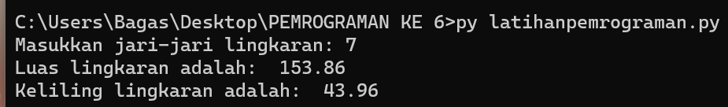

# Labpy03

## Latihan 1 (latihan1.py)
- Program ini menghasilkan n bilangan acak yang lebih kecil dari 0.5.
- Nilai n dimasukkan saat runtime.
- Menggunakan fungsi `random()` dari modul `random`.

## Latihan 2 (latihan2.py)
- Program ini menampilkan bilangan terbesar dari n buah data yang diinputkan.
- Masukkan angka 0 untuk berhenti.

## Program 1 (program1.py)
- Seorang pengusaha menginvestasikan uangnya dengan modal awal 100 juta.
- Pada bulan pertama dan kedua, belum mendapatkan laba.
- Pada bulan ketiga, mulai mendapatkan laba sebesar 1%.
- Pada bulan kelima, pendapatan meningkat 5%.
- Pada bulan kedelapan, mengalami penurunan keuntungan sebesar 2%.
- Program ini menghitung total keuntungan selama 8 bulan berjalan.

## Screenshot Hasil

